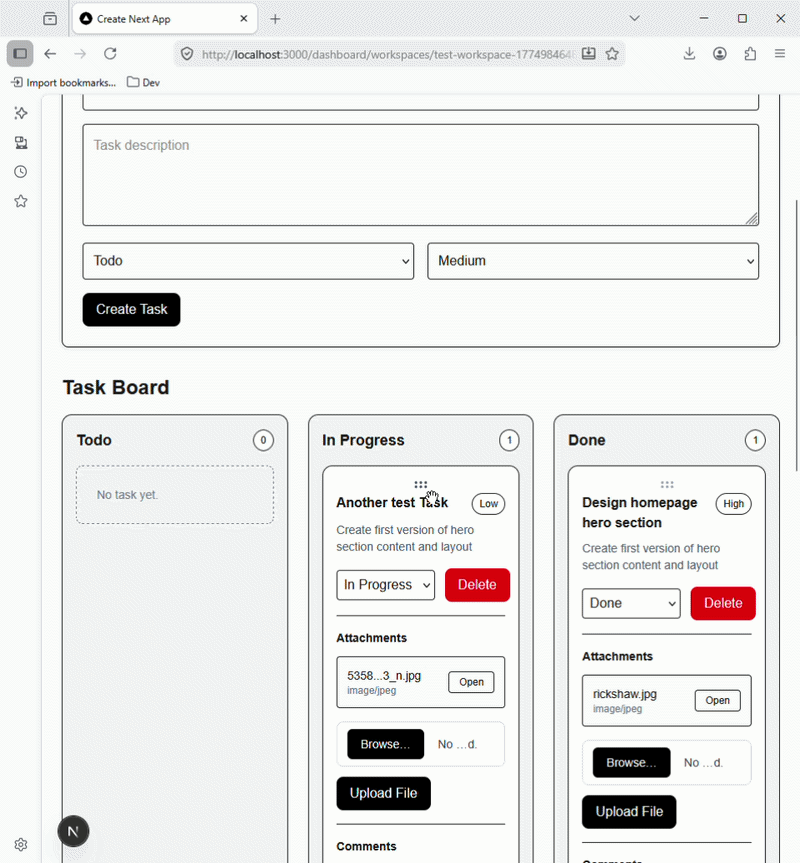
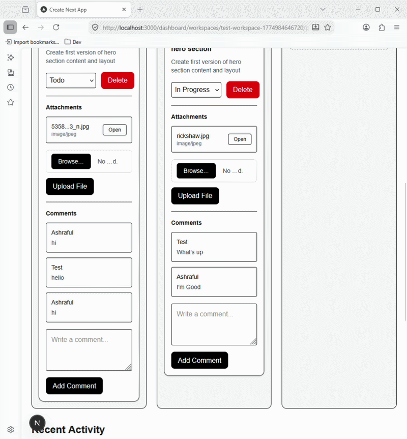
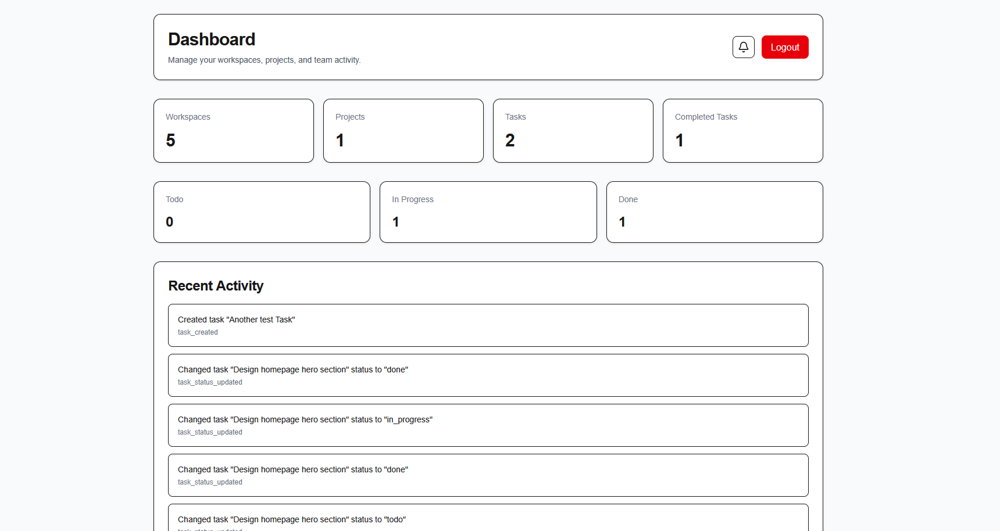
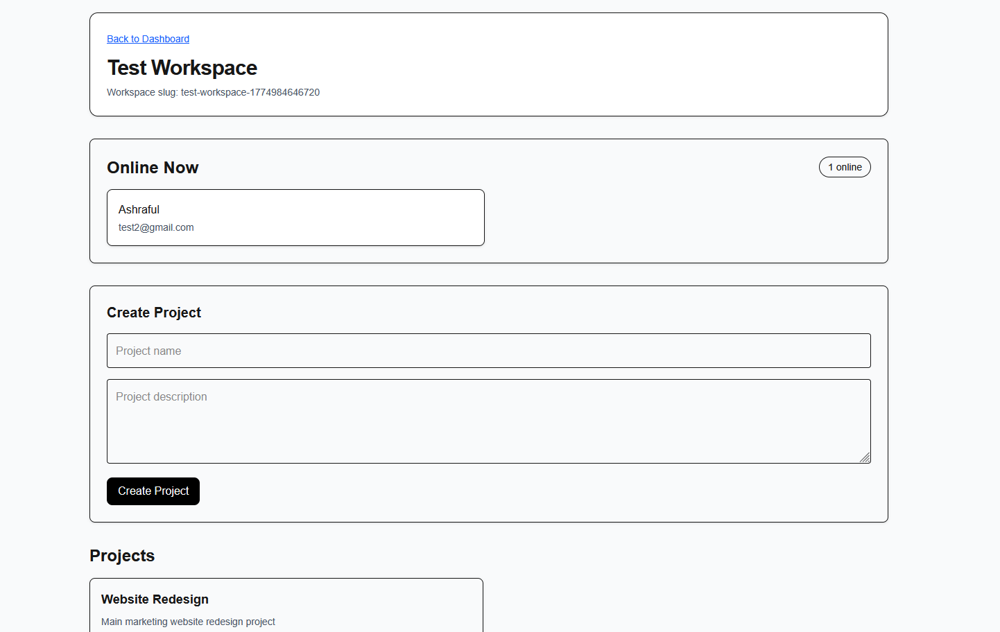
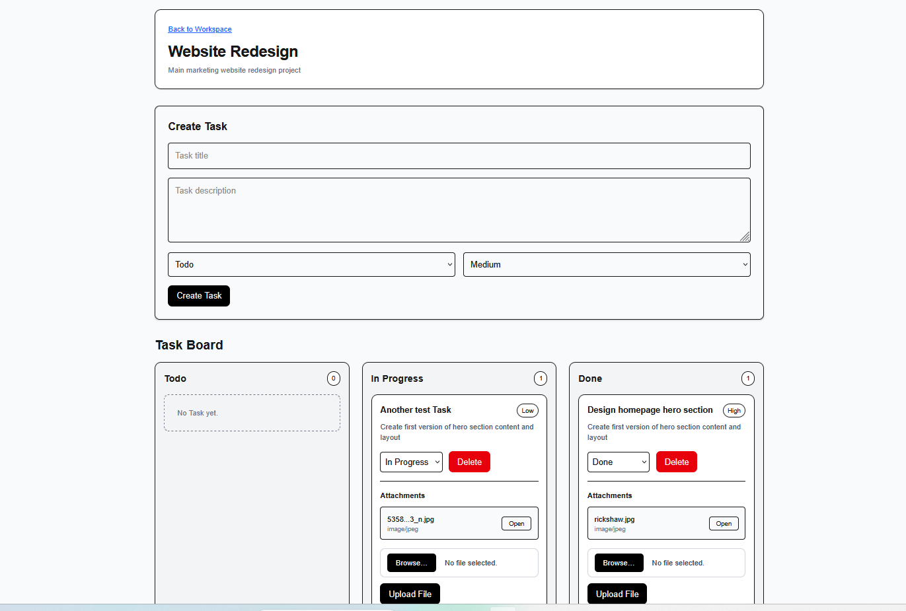

# 🚀 CollabStack — Real-Time Collaborative SaaS Platform

> Notion meets Linear — a production-ready team collaboration platform with live presence, Kanban, and real-time sync.

[](https://collabstack-beta.vercel.app)
[](https://nextjs.org)
[](https://supabase.com)
[](https://www.typescriptlang.org)
[](https://vercel.com)
[](LICENSE)

---

## 🌐 Live Demo

👉 **[collabstack-beta.vercel.app](https://collabstack-beta.vercel.app)**

---

## 🎬 Demo

### Drag-and-Drop Kanban


### Real-Time Typing Indicators


---

## 📸 Screenshots

### Dashboard


### Workspace


### Task Board


---

## 🧠 What Problem This Solves

Remote teams need more than task lists — they need **live awareness of what teammates are doing, in real time**. CollabStack solves:

- **Real-time collaboration** — task updates, comments, and presence sync instantly across all connected users
- **Multi-tenant workspaces** — teams are fully isolated with Row Level Security at the database level
- **File-based workflows** — attachments uploaded directly to tasks with secure signed URL access
- **Zero-refresh UX** — Supabase Realtime pushes all changes to the UI without page reloads

Built on the same architectural patterns used in 3.5+ years of delivering production SaaS and enterprise systems across Bangladesh, India, and Sri Lanka — reducing operational processing time by up to 40% through seamless integrations.

---

## ✨ Features

### 🏢 Workspace & Team
- Multi-tenant workspace architecture
- Email-based member invitations with accept/reject flow
- Role-based access — Owner / Member
- Live invitation notification badge

### 📋 Project & Task Management
- Projects scoped to workspaces
- Full task CRUD
- Kanban board — Todo / In Progress / Done
- Drag-and-drop task reordering

### ⚡ Real-Time Collaboration
- Live task create / update / delete across all clients
- Real-time comments per task
- Typing indicators in task comment threads
- Online presence tracking (who's currently viewing)

### 📁 File Attachments
- Upload files directly to tasks
- Secure storage via Supabase Storage
- Access controlled via signed URLs

### 📊 Dashboard Analytics
- Workspace, project, and task counts
- Task status breakdown
- Recent activity feed

### 🎨 UI / UX
- Clean SaaS-style layout
- Fully responsive design
- Polished empty states
- Consistent component design system

---

## 🛠️ Tech Stack

| Layer | Technology |
|---|---|
| Framework | Next.js 14 (App Router) |
| Language | TypeScript |
| Styling | Tailwind CSS |
| Database | Supabase (PostgreSQL) |
| Auth | Supabase Auth |
| Realtime | Supabase Realtime (Postgres Changes + Presence) |
| Storage | Supabase Storage |
| Deployment | Vercel |

---

## 🏗️ Architecture

```
Client (Next.js App Router)
        ↓
Server Components + Supabase Client
        ↓
Supabase
├── PostgreSQL   — workspaces, projects, tasks, comments
├── Auth         — user management & sessions
├── Realtime     — live updates & presence channels
└── Storage      — file attachments with signed URLs
```

**Key architectural decisions:**
- Row Level Security (RLS) enforces multi-tenant data isolation at the database level — no application-level tenant filtering needed
- Client + Server component split keeps sensitive DB calls server-side
- Supabase Realtime channels scoped per workspace for efficient subscriptions
- Presence tracked via Supabase Broadcast — no polling

---

## 📁 Project Structure

```
src/
├── app/                  # Next.js App Router pages & layouts
│   ├── (auth)/           # Login / register flows
│   ├── dashboard/        # Main app shell
│   └── workspace/        # Workspace, project, task views
├── components/           # Reusable UI components
│   ├── kanban/           # Drag-and-drop board
│   ├── tasks/            # Task cards, modals, comments
│   └── ui/               # Base design system
├── lib/                  # Supabase client, helpers, types
└── hooks/                # Custom React hooks for realtime

supabase-schema.sql       # Full DB schema with RLS policies
```

---

## 🚀 Getting Started

```bash
# 1. Clone
git clone https://github.com/ashrafakib02/collabstack
cd collabstack

# 2. Install
npm install

# 3. Configure environment
cp .env.example .env.local
```

Add your Supabase credentials to `.env.local`:
```env
NEXT_PUBLIC_SUPABASE_URL=your_supabase_url
NEXT_PUBLIC_SUPABASE_ANON_KEY=your_anon_key
```

```bash
# 4. Set up the database
# Run supabase-schema.sql in your Supabase SQL editor

# 5. Start dev server
npm run dev
```

---

## 🔮 Roadmap

- [ ] Stripe billing integration (per-seat pricing)
- [ ] Admin vs Member role permissions
- [ ] Task deadlines & email reminders
- [ ] Notifications dropdown
- [ ] Docker Compose for local Supabase dev

---

## 👨‍💻 Author

**Ashraful Islam** — Full-Stack Developer  
5+ years building production systems across Bangladesh, India, and Sri Lanka.  
Delivered high-performance web, mobile, and real-time applications — reducing processing time by 40% and maintaining 99.95% uptime SLAs.

- LinkedIn: [linkedin.com/in/ashrafakib](https://linkedin.com/in/ashrafakib)
- Email: ashrafakib02@gmail.com
- GitHub: [github.com/ashrafakib02](https://github.com/ashrafakib02)
- Open to remote backend / full-stack roles
